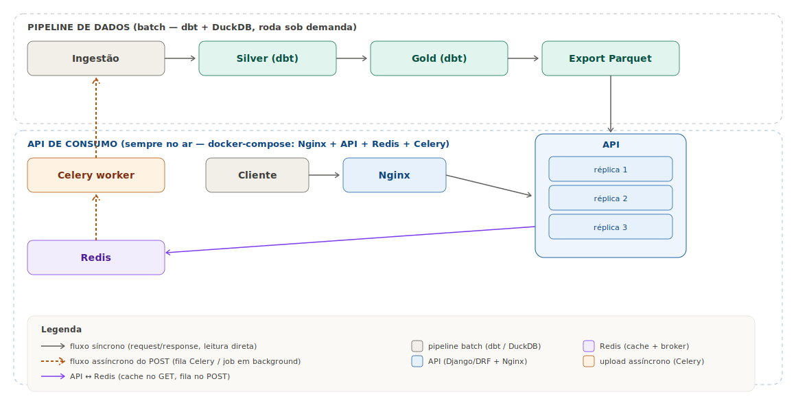

# CS2 Data Engineering — Pipeline Medalhão + API de Consumo


Projeto acadêmico/portfólio de engenharia de dados: partidas de CS2 (demos
`.dem` de campeonatos profissionais) são parseadas, transformadas numa
arquitetura medalhão (**bronze → silver → gold**) com dbt + DuckDB, e
servidas por uma API REST (Django/DRF) escalável horizontalmente, atrás de
um load balancer, com cache e processamento assíncrono. **Ainda em
desenvolvimento** — este README reflete o estado atual, não um produto
terminado.

### Highlights técnicos

- **Pipeline medalhão completo e funcional**: 22 partidas de 2 campeonatos
  reais parseadas, transformadas e testadas — não um dataset sintético.
- **Qualidade de dados validada contra fonte externa**: métricas de kill/
  team-kill conferidas campo-a-campo contra a HLTV (10/10 jogadores batendo).
- **Bugs reais de engenharia, resolvidos e documentados**: precisão de
  SteamID64 perdida em `float64`, artefato de "round reiniciado" contado
  como 10 mortes falsas, condição de corrida de upload que quase apagou
  uma demo real — cada um com causa raiz e correção rastreável no `CLAUDE.md`.
- **API desenhada para produção, não só para funcionar**: cache Redis,
  paginação/filtro empurrados pro SQL, upload assíncrono via Celery (lote
  `.zip`), N réplicas atrás de Nginx com re-resolução de DNS automática.
- **Decisões de arquitetura documentadas com o porquê**, não só o quê —
  ver [Por que essas decisões de arquitetura](#por-que-essas-decisões-de-arquitetura).



## Índice

- [Objetivo](#objetivo)
- [Visão geral em uma frase](#visão-geral-em-uma-frase)
- [Como funciona: o pipeline de dados](#como-funciona-o-pipeline-de-dados)
- [Como funciona: a API de consumo](#como-funciona-a-api-de-consumo)
- [Por que essas decisões de arquitetura](#por-que-essas-decisões-de-arquitetura)
- [Aquisição de demos (manual, por decisão)](#aquisição-de-demos-manual-por-decisão)
- [Rodando o projeto do zero](#rodando-o-projeto-do-zero)
- [Endpoints da API](#endpoints-da-api)
- [Qualidade de dados](#qualidade-de-dados)
- [Estrutura do repositório](#estrutura-do-repositório)
- [Stack](#stack)
- [Status atual](#status-atual)
- [Sobre o desenvolvimento](#sobre-o-desenvolvimento)

## Objetivo

Contra-Strike 2 (CS2) é um jogo de tiro 5×5 competitivo. Toda partida
profissional gera uma **demo** (`.dem`): uma gravação binária de tudo que
aconteceu — cada tiro, cada morte, a posição de cada jogador em cada
fração de segundo. Uma demo sozinha não serve de nada pra análise; é só
um arquivo binário proprietário. Este projeto existe pra responder uma
pergunta simples de engenharia de dados: **como transformar uma pilha de
arquivos `.dem` crus em uma API que responde "quantos headshots o jogador
X deu na BombsiteB do mapa Mirage, contando só as fases eliminatórias"?**

O projeto cobre a cadeia inteira necessária pra isso — parsing do binário,
modelagem em camadas, testes de qualidade sobre dados reais (não
suposições), e uma API pensada pra ser consumida em produção (cache,
paginação, upload assíncrono, múltiplas réplicas atrás de um load
balancer) — não só um notebook de análise pontual.

## Visão geral em uma frase

```
.dem (binário) → parse (awpy) → bronze (Parquet)
     → silver/gold (dbt + DuckDB, tipado e testado)
     → export (Parquet) → API (Django/DRF, N réplicas atrás de Nginx)
     → cliente (curl, dashboard externo, o que for)
```

Duas metades independentes, que só se encontram no Parquet exportado da
gold:

1. **Pipeline de dados** — roda sob demanda (você decide quando), não
   precisa estar sempre no ar. Onde a inteligência analítica mora.
2. **API de consumo** — roda sempre no ar (containers Docker), escalável
   horizontalmente. Onde a robustez de servir tráfego mora.

## Como funciona: o pipeline de dados

A arquitetura **medalhão** (bronze/silver/gold) é um padrão comum em
engenharia de dados pra organizar transformação em estágios, cada um com
uma responsabilidade única. A ideia central: **nunca misturar "ainda não
confio nesse dado" com "já validei esse dado"** na mesma tabela.

### 1. Bronze — dado cru, sem julgamento

```
ingestion/carregar_demo_duckdb.py demos/evento/fase/partida.dem
```

Um parser (a lib [`awpy`](https://github.com/pnxenopoulos/awpy)) lê o
binário `.dem` e devolve ~9 tabelas: `header` (metadados da partida),
`rounds` (ciclo de vida de cada round), `kills`, `damages`, `grenades`,
`shots`, `bomb`, `ticks` (posição/vida de cada jogador, capturada a cada
fração de segundo) e `cvars` (configuração do servidor).

A bronze grava essas tabelas **exatamente como vieram do parser, sem
nenhum tratamento de tipo** — toda coluna é convertida pra `VARCHAR`
(texto) antes de gravar. Isso parece estranho à primeira vista (por que
não já tipar tudo?), mas é uma decisão deliberada: já aconteceu na
prática de demos diferentes trazerem os mesmos campos em ordens ou
formatos levemente diferentes, e uma ingestão que tenta ser "esperta"
sobre tipo quebra no primeiro dado inesperado. A bronze prioriza **nunca
falhar por causa do formato** — ela só copia o que existe. Qualquer
decisão de tipo (é inteiro? é booleano? é timestamp?) fica pra depois.

Cada partida vira um arquivo **Parquet** por tabela, particionado pela
estrutura de pastas `evento/fase/confronto` (ex.:
`output/parquet/bronze/kills/iem-cologne-major-2026/final/furia-vs-falcons-m1-mirage.parquet`).
Rodar o mesmo arquivo de novo é seguro (idempotente): a carga é pulada se
a partida já existir, a menos que você peça `--forcar`.

### 2. Silver — dado tipado e limpo

```
cd dbt && ../.venv/Scripts/dbt.exe run --profiles-dir . --select silver
```

A camada **silver** (implementada como models [dbt](https://www.getdbt.com/))
lê a bronze e faz o trabalho que a bronze recusou fazer: cast pro tipo
certo (`INTEGER`, `BIGINT`, `DOUBLE`, `BOOLEAN`, `TIMESTAMP`), tratamento
de string vazia como nulo, e algumas correções de dado real encontradas
no caminho — por exemplo, o servidor às vezes registra um "round
reiniciado" como se 10 jogadores tivessem se matado no mesmo instante
exato (artefato técnico, não morte de jogo real); a silver filtra esse
padrão fora, com um teste de regressão garantindo que ele não volte
silenciosamente.

A silver também calcula colunas derivadas que a bronze não tem, como
`duracao_segundos` de um round e `segundos_desde_inicio_round` de cada
evento — a taxa de tick (quantas capturas por segundo o servidor fez)
varia entre demos e é descoberta automaticamente a partir dos metadados
de cada partida, nunca assumida como constante.

### 3. Gold — dado pronto pra responder perguntas de negócio

```
cd dbt && ../.venv/Scripts/dbt.exe run --profiles-dir . --select gold
```

A camada **gold** agrega a silver no grão que interessa pra consumo:
**1 linha por jogador por partida**. É aqui que moram as métricas
prontas — kills, headshots, dano causado, granadas lançadas por
categoria, tempo passado em cada área do mapa, plants/defuses de bomba, e
**clutches** (situações de 1 jogador contra vários adversários, com
breakdown 1v1 até 1v5, calculado via window functions SQL sobre o saldo
de jogadores vivos por round — sem precisar de nenhum código Python
imperativo). Views de ranking agregam essas tabelas de fato em diferentes
recortes (por partida, por fase, por evento, por mapa) sempre recalculando
na consulta, nunca guardando um número pré-somado que ficaria desatualizado.

### 4. Export — a ponte pra API

```
cd dbt && ./build_e_exportar.ps1
```

Depois que a gold é (re)calculada, ela é exportada inteira pra arquivos
**Parquet** (`output/parquet/gold/*.parquet`). Esse é o único ponto de
contato entre o pipeline de dados e a API — e é proposital: a API nunca
abre o banco DuckDB onde silver/gold moram, só lê esses Parquet.
`build_e_exportar.ps1` automatiza os dois passos (rodar o dbt e exportar)
num comando só, e só exporta se o `dbt build` passar em todos os testes.

## Como funciona: a API de consumo

A segunda metade do projeto é uma API REST (Django + Django REST
Framework) desenhada pra estar sempre disponível e aguentar carga —
diferente do pipeline de dados, que roda quando você manda. A pergunta
de arquitetura aqui não é "como transformar dado", é **"como servir
milhares de requisições sem que o processo de carga de uma demo nova
trave alguém que só quer consultar estatísticas"**.

```
Cliente
   │  HTTP
   ▼
Nginx  ──────────────────────────────┐  load balancer round-robin,
   │                                  │  re-resolve DNS a cada ~10s
   ▼                                  ▼
API réplica 1   API réplica 2   API réplica 3   ← quantas você quiser
   │                │                │
   └───────┬────────┴────────┬───────┘
           ▼                 ▼
       Redis (cache      Redis (fila
        dos GET)          do POST)
                              │
                              ▼
                       Celery worker
                              │
                              ▼
                    Ingestão (escreve a bronze)
```

### As réplicas e o load balancer (a parte de "scaling")

A API roda como **N cópias idênticas** do mesmo container (`docker
compose up --scale api=N`) atrás de um **Nginx** configurado como load
balancer round-robin — cada requisição vai pra uma réplica diferente,
distribuindo carga. Escalar horizontalmente aqui é trivial porque a API
**não guarda estado nenhum em memória**: cada réplica lê os mesmos
arquivos Parquet e fala com o mesmo Redis, então qualquer uma pode
responder qualquer request. Duas réplicas ou vinte, o comportamento é
idêntico — só a capacidade de atender requisições simultâneas muda.

Um detalhe de infraestrutura que só aparece testando de verdade: o Nginx
**open-source** não re-resolve automaticamente o IP de um `upstream {}`
com nome de serviço fixo (isso é um recurso pago do Nginx Plus) — então
se você recriar uma réplica, ela ganha um IP novo e o Nginx continua
tentando o IP antigo até reiniciar manualmente. A solução usada aqui
(`nginx/nginx.conf`) é rodar todas as réplicas sob o **mesmo** nome de
serviço Docker (`api`) e configurar o Nginx pra usar `resolver` do próprio
Docker DNS, re-resolvendo esse nome a cada ~10 segundos — na prática,
matar e recriar uma réplica nunca exige nenhuma ação manual.

### Por que GET e POST se comportam tão diferente

Um `GET` (ex.: "me dê os kills do jogador X") é uma leitura simples: a
réplica abre uma conexão DuckDB em memória, faz `SELECT` direto nos
arquivos Parquet exportados, aplica paginação e filtro no próprio SQL (não
em Python), e devolve. Pra evitar reprocessar a mesma consulta repetida
vezes, o resultado é **cacheado no Redis** por um TTL fixo, chaveado pela
URL completa (incluindo os query params de filtro).

Um `POST` de upload (mandar uma demo nova) é outra categoria de problema:
parsear uma demo grande leva **minutos**, e a própria requisição de
upload de um arquivo de centenas de MB numa conexão lenta já pode
ultrapassar timeouts padrão. Fazer isso de forma síncrona bloquearia uma
réplica inteira por minutos, então o `POST` só grava o arquivo em disco,
enfileira o processamento no **Redis** (que aqui atua como *broker*, fila
de mensagens) e devolve imediatamente um código 202 + um `job_id` — o
processamento de verdade acontece num **worker Celery** separado, em
background. O cliente consulta `GET /api/demos/status/<job_id>/` pra saber
quando terminou.

Esse worker reusa a mesma função Python que a carga manual via linha de
comando usa (`carregar_demo`) — não existe uma segunda implementação de
parsing pra API, é literalmente o mesmo código.

### Onde a API para e o pipeline de dados começa

O `POST` de upload só avança a demo até a **bronze** (Parquet). Silver,
gold e o export final continuam sendo um passo manual
(`dbt/build_e_exportar.ps1`), de propósito — rodar o `dbt build` inteiro
(com todos os seus testes) a cada upload individual seria caro e
redundante se vários uploads chegarem em sequência. Ver
[`docs/fluxo_novas_demos.md`](docs/fluxo_novas_demos.md) pro passo a
passo completo, incluindo os dois jeitos de carregar uma demo nova (CLI
local ou API).

## Por que essas decisões de arquitetura

Um resumo dos porquês mais importantes, pra quem quer entender o
raciocínio por trás do código, não só o que ele faz:

- **Por que a API nunca abre o banco DuckDB diretamente?** DuckDB permite
  só **1 processo leitor-escritor por vez** (ou vários leitores, nunca os
  dois simultâneos). Com 3+ réplicas da API rodando ao mesmo tempo que o
  pipeline de dados, essa restrição inviabilizaria acesso concorrente. A
  API lê só os Parquet exportados — arquivos imutáveis, sem essa
  limitação, e o desacoplamento significa que o uptime da API nunca
  depende do pipeline estar rodando.
- **Por que a bronze virou Parquet em vez de tabela DuckDB?** A bronze é
  a camada mais pesada (grava tudo como texto, sem otimização de tipo).
  Mantê-la como tabela DuckDB significava um único arquivo `.duckdb`
  gigante, sincronizado pelo OneDrive nesse ambiente — risco real de
  lock/corrupção. Como cada partida (`match_id`) é gravada de uma vez só,
  num arquivo Parquet próprio, nunca precisa de operação incremental
  (merge/upsert) — só *silver* e *gold* precisam disso, e por isso
  continuam em tabela DuckDB nativa (onde o dbt já resolve incremental
  nativamente).
- **Por que Django + DRF sem ORM?** O projeto não tem um banco relacional
  tradicional por trás — os dados de CS2 vivem em Parquet, consultados
  via SQL direto no DuckDB. Django aqui é só a camada HTTP (roteamento,
  serialização, validação), não o dono dos dados.
- **Por que Celery/Redis pro upload, mas cache simples (TTL) pro GET?**
  São dois problemas diferentes: o upload precisa de **fila** (trabalho
  que vai ser feito eventualmente, sem bloquear quem pediu); o GET precisa
  de **cache** (evitar refazer um trabalho que provavelmente vai ser
  pedido de novo em breve). Redis serve os dois papéis nesse projeto, mas
  com padrões de uso distintos.

## Aquisição de demos (manual, por decisão)

Este projeto **não automatiza o download de demos** — é uma decisão
deliberada, não uma lacuna a resolver. A [HLTV](https://www.hltv.org/) (a
principal fonte de demos de campeonatos profissionais de CS2) não expõe
API oficial e usa proteção anti-bot agressiva; scraping automatizado
seria frágil e violaria os termos de uso do site. O passo a passo manual:

1. Encontre a partida desejada em [hltv.org/results](https://www.hltv.org/results)
   e abra a página do confronto.
2. Baixe o(s) arquivo(s) `.dem` da partida (geralmente em "GOTV Demo" na
   página do confronto; partidas MD3/MD5 costumam ter um `.dem` por mapa,
   às vezes dividido em partes `-p1`/`-p2`).
3. Organize os arquivos em `./demos/<evento>/<fase>/`, ex.:
   `demos/iem-cologne-major-2026/final/furia-vs-falcons-m1-mirage.dem`
   (a subpasta por evento/fase é obrigatória — é dela que o `match_id` é
   derivado, ver `CLAUDE.md`).
4. Carregue com a CLI (`ingestion/carregar_demo_duckdb.py`) ou via
   `POST /api/demos/` — ver [Rodando o projeto do zero](#rodando-o-projeto-do-zero)
   e [`docs/fluxo_novas_demos.md`](docs/fluxo_novas_demos.md) pro fluxo completo.

## Rodando o projeto do zero

### 1. Ambiente

```bash
python -m venv .venv
.venv/Scripts/pip install -r requirements.txt
```

### 2. Pipeline de dados (ingestão → bronze → silver/gold → export)

```bash
# coloque uma ou mais .dem em demos/<evento>/<fase>/

# 1. ingestão — parseia .dem e grava a bronze em Parquet
.venv/Scripts/python.exe ingestion/carregar_demo_duckdb.py

# 2. transformação (silver + gold via dbt) + export da gold pra Parquet, num só comando
cd dbt
./build_e_exportar.ps1
cd ..
```

### 3. API, com scaling (Docker Compose)

```bash
cp api/.env.example api/.env
docker compose up -d --build --scale api=3
```

A API sobe em `http://localhost:8080/api/...`, atrás do Nginx, já
balanceando entre as 3 réplicas. Pra escalar pra mais (ou menos)
réplicas, sem downtime perceptível:

```bash
docker compose up -d --build --scale api=6
```

Comandos úteis pra operar depois de subido:

```bash
docker compose ps                      # status dos containers
docker compose logs api --tail 100     # logs das réplicas (prefixados por nome)
docker compose logs celery_worker -f   # acompanhar o worker em tempo real
docker compose restart celery_worker   # depois de mudar cs2api/tasks.py
```

Detalhes completos (rodando sem Docker pra debug local, limitações
conhecidas do worker) em [`api/README.md`](api/README.md).

### 4. Adicionar demos depois (upload via API em vez de CLI)

Ver [`docs/fluxo_novas_demos.md`](docs/fluxo_novas_demos.md) pro fluxo
completo, incluindo `POST /api/demos/` com upload de `.zip` em lote.

## Endpoints da API

```bash
# listar partidas carregadas, filtrando por fase
curl "http://localhost:8080/api/partidas/?fase=final"

# combate de um jogador, paginado
curl "http://localhost:8080/api/combate/?mapa=de_mirage&page_size=20"

# subir uma demo nova (assíncrono)
curl -F "evento=iem-cologne-major-2026" -F "fase=final" \
     -F "arquivo=@partida.dem" http://localhost:8080/api/demos/

# acompanhar o processamento
curl http://localhost:8080/api/demos/status/<job_id>/
```

| Endpoint | O que devolve |
|---|---|
| `GET /api/partidas/` | `dim_partida` — evento, fase, mapa, confronto, formato (MD1/MD3/MD5), times |
| `GET /api/combate/` | kills, headshots, mortes, assistências, dano por jogador×partida |
| `GET /api/granadas/` | granadas lançadas por categoria, por jogador×partida |
| `GET /api/posicionamento/` | tempo/ticks passados em cada área do mapa, por jogador×partida |
| `GET /api/bomba/` | plants e defuses por jogador×partida |
| `POST /api/demos/` | upload assíncrono de demo(s), retorna `job_id` |
| `GET /api/demos/status/<job_id>/` | status do processamento em background |

Todos os `GET` aceitam `page`/`page_size` (máx. 500) e filtro por coluna
via query string. Lista completa de colunas filtráveis e exemplos em
[`api/README.md`](api/README.md).

## Qualidade de dados

Testes dbt (`not_null`, `unique`, `accepted_values` e invariantes
customizadas) rodando sobre os dados reais já carregados — não são
suposições sobre o schema, cada teste foi validado contra o dataset atual
antes de ser escrito, incluindo uma auditoria sistemática de `% de NULL`
por coluna em toda a silver/gold. Alguns exemplos de invariante real
encontrada e coberta por teste de regressão:

- Um "round reiniciado" pelo servidor não deve ser contado como 10 mortes
  reais (`assert_sem_artefato_reinicio_em_kills.sql`).
- Uma granada em voo sempre tem posição XYZ preenchida; uma granada "na
  mão" nunca tem (`assert_grenades_xyz_nulo_deterministico.sql`).
- Uma linha de fato jogador×partida nunca se repete
  (`assert_combate_jogador_partida_unico.sql` e equivalentes).

Ver `dbt/models/silver/_silver__models.yml`, `dbt/models/gold/_gold__models.yml`
e `dbt/tests/` pra suíte completa.

## Estrutura do repositório

```
ingestion/     parsing das demos, carga na bronze (Parquet), export Parquet da gold
dbt/           transformação silver/gold (models, macros, testes, docs)
docs/          dicionário de dados + fluxo de operação, validados contra dados reais
api/           projeto Django/DRF (GET paginado, POST assíncrono de upload)
nginx/         config do load balancer
demos/         arquivos .dem de origem (não versionado — arquivos grandes)
output/        banco DuckDB (silver/gold) + Parquet (bronze + gold exportada), não versionado
```

## Stack

**Dados**: Python 3.11 · [`awpy`](https://github.com/pnxenopoulos/awpy) (parser de demos) · [DuckDB](https://duckdb.org/) · [dbt-core](https://www.getdbt.com/) + `dbt-duckdb` · Parquet

**API**: Django + [Django REST Framework](https://www.django-rest-framework.org/) · [Celery](https://docs.celeryq.dev/) · [Redis](https://redis.io/) · [Gunicorn](https://gunicorn.org/) · [Nginx](https://nginx.org/) · [Docker](https://www.docker.com/) / Docker Compose

## Status atual

- ✅ Ingestão (bronze): parsing de `.dem` com `awpy` e carga idempotente em Parquet particionado por evento/fase/confronto.
- ✅ Transformação (silver/gold): implementada em dbt — lê a bronze Parquet, materializa silver/gold como tabela incremental no DuckDB, com testes de qualidade e colunas derivadas.
- ✅ **API de consumo**: endpoints `GET` paginados/filtrados e `POST` de upload assíncrono (`.dem`/`.zip` em lote) via Celery + Redis.
- ✅ **Infraestrutura escalável**: Docker Compose com Nginx como load balancer na frente de N réplicas da API, cache Redis e worker Celery dedicado.
- 🔵 Aquisição de demos: manual por decisão (não scraping) — ver [Aquisição de demos](#aquisição-de-demos-manual-por-decisão).
- ⏳ Export Parquet → API ainda é um passo manual depois do `dbt build` (não automatizado de propósito, ver `CLAUDE.md`).
- 🔵 Testes automatizados: não fazem parte do escopo deste projeto (decisão do autor).

## Sobre o desenvolvimento

Este projeto foi construído em parceria com o **Claude** (Anthropic) —
boa parte da codificação (models dbt, código Python/Django, configuração
de infraestrutura) foi escrita com o assistente. As decisões de
arquitetura, escolha de tecnologias (dbt, DuckDB, Django/DRF, Celery,
Redis, Nginx, Docker) e critérios de negócio (ex.: como detectar formato
MD1/MD3/MD5, como não contar team-kill como abate) são minhas — usei o
Claude pra validar, questionar e implementar essas decisões, e sempre
revisei o resultado antes de aceitar. Vários problemas reais de
engenharia (limite de concorrência do DuckDB, timeout de upload, DNS
estático do Nginx, um bug que quase apagou uma demo real) só apareceram
testando de verdade, não só lendo o código — parte do valor deste projeto
pra mim foi justamente aprender debugando isso ao vivo.
